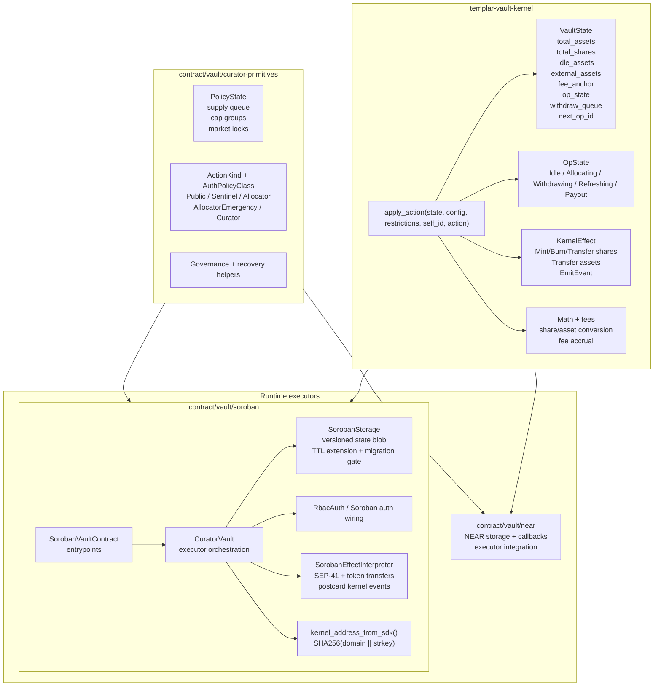
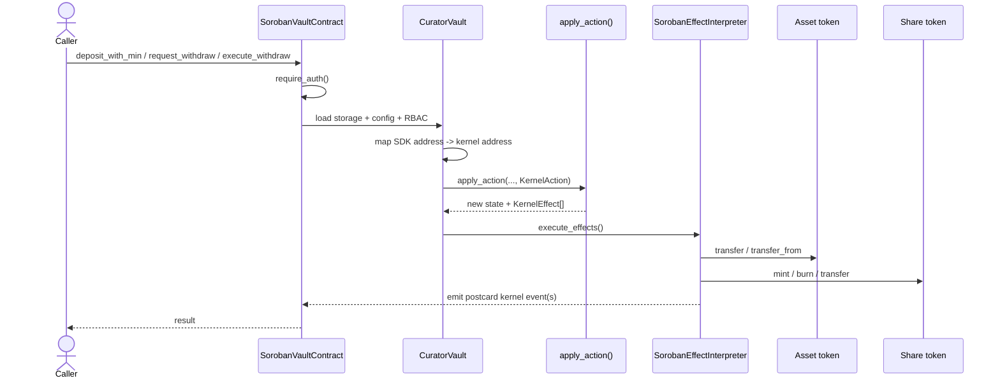
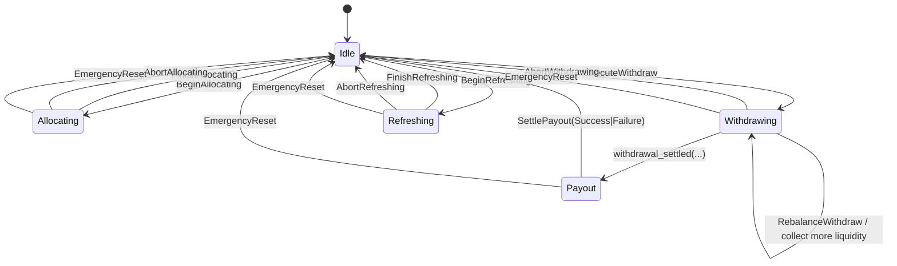
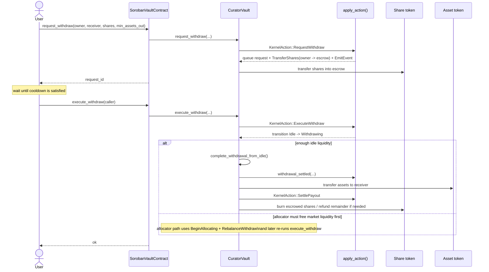
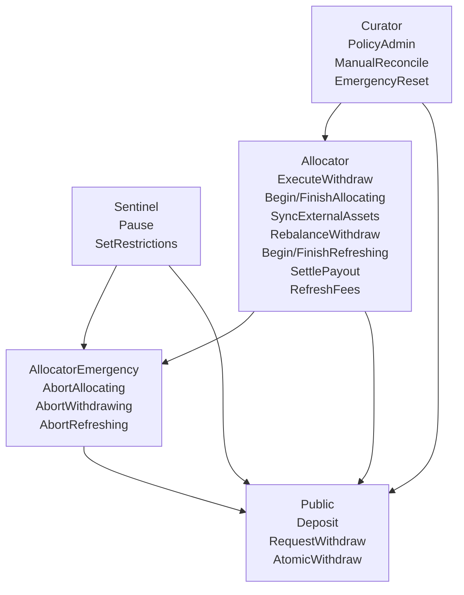

# Vault

This directory contains shared vault runtime/testing material for the kernel, NEAR executor, and Soroban executor.

## Architecture

The vault system follows a kernel + executor split:

- `templar-vault-kernel` is the chain-agnostic source of truth for state transitions, math, and invariants.
- `contract/vault/near` executes kernel behavior on NEAR (storage, callbacks, token interfaces, gas-specific concerns).
- `contract/vault/soroban` executes kernel behavior on Soroban (storage/auth wiring and sync execution model).
- `contract/vault/curator-primitives` holds shared policy/recovery helpers used by executors.

### Current Soroban Flow

The Soroban executor is the most feature-complete runtime today. It loads a
versioned state blob, maps Soroban addresses into kernel addresses, dispatches a
`KernelAction`, executes the returned `KernelEffect`s, and then persists the new
state.

### Kernel Operation State Machine

### Public Withdrawal Lifecycle

### Authorization Model

Canonical action policy lives in `contract/vault/curator-primitives/src/auth/mod.rs`.
The Soroban runtime enforces the same action classes through `RbacAuth` and
`require_auth()`.

## Parity Tests

Parity tests verify behavioral equivalence across the kernel and executors.

## Test and Verification Recipes

Use the vault recipe index in [contract/vault/justfile](./justfile).

If you run from repo root, call recipes as:
- `just -f contract/vault/justfile <recipe>`

Core recipes:
- Kernel test suite: `kernel-test`
- Kernel property tests: `kernel-prop`
- Curator primitives tests: `curator-test`
- Curator primitives property tests: `curator-prop`
- NEAR integration tests: `near-test`
- Soroban unit/integration recipes: `soroban-test`, `soroban-prop`, `soroban-integration`
- Cross-surface parity run: `parity`
- Full vault test sweep: `vault-test`
- Gas reporting: `gas-report`

Soroban runtime/deployment workflows are in [contract/vault/soroban/justfile](./soroban/justfile).

Gas baselines are stored in `contract/vault/near/gas_baseline.json`.

### Interpreting Gas Results

| Action             | Typical Gas | Description                     |
|--------------------|-------------|---------------------------------|
| `supply`           | ~8.2 Tgas   | Deposit assets, mint shares     |
| `allocate`         | ~20.7 Tgas  | Allocate idle to market         |
| `withdraw`         | ~4.4 Tgas   | Request withdrawal              |
| `execute_withdraw` | ~10.0 Tgas  | Execute pending withdrawal      |
| `submit_cap`       | ~2.7 Tgas   | Submit allocation cap           |

## Property Test Categories

### Shared Properties (Kernel)

| Category      | Properties | Description                         |
|---------------|------------|-------------------------------------|
| Accounting    | 10         | Total assets = idle + external      |
| Queue         | 15         | FIFO, length bounds, status         |
| Conversion    | 10         | Share/asset roundtrips              |
| Fees          | 10         | Non-negative, bounded, monotonic    |
| State Machine | 15         | Transition guards, op ID matching   |
| Escrow        | 10         | Settlement conservation             |

### Parity Properties (Soroban)

| Property                        | Verified Against          |
|---------------------------------|---------------------------|
| `prop_accounting_invariant`     | Kernel accounting rules   |
| `prop_roundtrip_bounded`        | Kernel conversion logic   |
| `prop_state_machine_completes`  | Kernel transitions        |
| `prop_effects_consistent`       | Kernel effect generation  |

## Adding New Parity Tests

1. Add property to kernel (`property_tests.rs`)
2. Add equivalent test to Soroban (`property_tests.rs`)
3. Validate with justfile recipes: `kernel-prop`, `soroban-prop`, `near-test`

## CI Integration

CI should invoke the same justfile recipes used locally (`kernel-prop`, `near-test`, `soroban-prop`).

## Security Docs

- Soroban STRIDE threat model: `contract/vault/soroban/STRIDE.md`
- Soroban runtime operational notes: `contract/vault/soroban/README.md`
