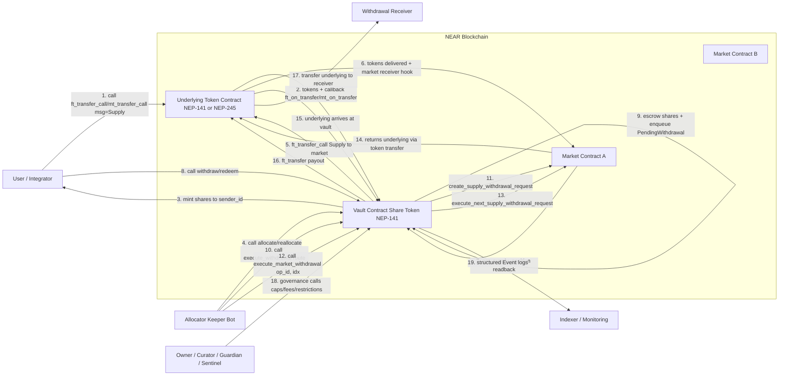

# Overview

- **Input text:** The Templar Vault is a NEAR smart contract that (1) accepts deposits of an underlying asset (NEP-141 or NEP-245), (2) mints a vault share token (NEP-141) to depositors, (3) keeps an on-chain `idle_balance` buffer, and (4) allocates idle funds into a curated set of external “market” contracts. Withdrawals are a two-phase flow: users enqueue a withdrawal by escrowing shares into a FIFO queue; an off-chain keeper with the Allocator role executes the head request by routing withdrawals across markets (route provided per execution), then pays the receiver and burns/refunds shares. Governance uses Owner + RBAC roles (Curator, Guardian, Sentinel, Allocator) with timelocks and optional account restrictions (Paused/BlackList/WhiteList).
- **In-scope entities:** Vault contract, share-token behavior, vault governance/roles, keeper execution, and cross-contract calls to the underlying token + markets.
- **Primary assets to protect:** Underlying tokens held by the vault, market principal accounting, share supply integrity, correctness/fairness of the withdrawal FIFO, governance configuration (caps, fees, restrictions), and operational liveness (ability to withdraw).
- **Trust boundaries:** Off-chain keeper(s) vs on-chain contract; external contracts (underlying token, each market) vs the vault; privileged roles vs unprivileged users; upgrade/admin keys (if the deployment is upgradeable) vs immutable code.

# Dataflows

## Main DFD (deposit, allocation, withdrawal)

## Notes needed to understand the flow

- The vault uses a single-op state machine `OpState` (`Idle → Allocating → Idle`; `Idle → Withdrawing → Payout → Idle`). Most mutating entrypoints require `Idle`; deposit via token receiver is a special case.
- Withdrawals are FIFO on request creation, but market routing is per execution (route is provided by the keeper and not stored as a global order).
- External dependencies are significant: correctness and liveness depend on the underlying token contract and each configured market contract.

# Threats

## STRIDE reminders

| Mnemonic | Threat | Definition | Question |
| --- | --- | --- | --- |
| S | Spoofing | Impersonate user/component | Is the caller who they claim? |
| T | Tampering | Unauthorized data/code modification | Was data/code modified? |
| R | Repudiation | Deny having taken an action | Can actions be proven later? |
| I | Information Disclosure | Excessive data exposure | Is private/sensitive data leaked? |
| D | Denial of Service | Reduce availability/liveness | Can availability be impacted? |
| E | Elevation of Privilege | Gain unauthorized privileges | Can roles/permissions be bypassed? |

## Threat table

| Threat | Issues |
| --- | --- |
| Spoofing | Spoof.1 (DFD 4,10,18) — Compromise of a privileged account (e.g., Allocator, Owner, Curator) lets an attacker impersonate the keeper/governance and execute fund-moving calls (`allocate`, `execute_withdrawal`, config changes). Spoof.2 (DFD 1–3) — If the configured underlying token contract is upgradeable/malicious, it could spoof `sender_id` in `ft_on_transfer`/`mt_on_transfer`, bypassing account restrictions (`Gate::enforce_policy`) and/or mis-attributing share mints. |
| Tampering | Tamper.1 (DFD 7,11,13–15) — A malicious/buggy market can return inconsistent `get_supply_position` data or behave unexpectedly in withdraw execution, attempting to tamper with the vault’s principal reconciliation (share price distortion, incorrect `market_supply`, stuck ops). Tamper.2 (DFD 15 vs internal state) — Direct underlying transfers to the vault account (not via `ft_transfer_call`) can change the vault’s real token balance without updating `idle_balance`, creating state desync that can distort `convert_to_shares`/`preview_*` until the next `ft_balance_of` resync. |
| Repudiation | Repudiate.1 (DFD 10,19) — If events/telemetry don’t fully bind critical operational decisions (who executed, and with what withdrawal route), a keeper can dispute responsibility for “bad routing” or delays; off-chain monitoring may be incomplete if it relies primarily on events rather than full transaction/receipt inspection. |
| Information Disclosure | Info.1 (DFD 9,19) — On-chain state + events expose user withdrawal queue details (owner, receiver, amounts, timestamps) and potentially restriction lists (whitelist/blacklist membership), enabling surveillance and targeted phishing/harassment of depositors/receivers. |
| Denial of Service | DoS.1 (DFD 10–13) — Withdrawal completion is allocator/keeper-driven; if keepers are offline, censored, or malicious, withdrawals can stall (queue head blocks progress). Market liquidity failures can also park withdrawals indefinitely. DoS.2 (DFD 8–9,18) — An attacker can pay storage to spam many small redeem requests, inflating queue work for keepers. Additionally, permissionless `refresh_markets` (single-op) can be used periodically to keep the vault non-Idle and delay allocator operations. |
| Elevation of Privilege | Elevation.1 (DFD 4,10,18 + callbacks) — Any bug/misconfiguration in RBAC checks (e.g., missing `assert_allocator`/owner checks) or callback protection (missing `#[private]`) could let an unprivileged caller invoke privileged flows or advance `OpState` via forged callback calls. Elevation.2 (deployment-level) — If the vault deployment remains upgradeable, compromise of upgrade/admin keys is equivalent to arbitrary code execution (full privilege escalation regardless of on-chain RBAC). |

# Mitigations

## Treatment table

| Threat | Issues |
| --- | --- |
| Spoofing | Spoof.1.R.1 — Use multisig/hardware-backed key management for Owner/Curator/Sentinel/Allocator accounts; minimize and routinely rotate full-access keys. Spoof.1.R.2 — Operational monitoring: alert on `Event::AllocatorRoleSet`, `Event::CuratorSet`, `Event::GuardianSet`, `Event::SentinelSet`, and unexpected allocator activity (DFD 19). Spoof.2.R.1 — Governance/process: only configure a well-audited, non-upgradeable (or tightly governed) underlying token contract; treat “token upgrade” as a critical change requiring the same scrutiny as a vault upgrade. |
| Tampering | Tamper.1.R.1 — Only whitelist audited market contracts; apply caps/cap-groups and the enabled flag, and be able to set cap=0 / disable quickly during incidents. Tamper.1.R.2 — Keep/extend reconciliation hardening: always bound credited deltas (min(before-after, remaining)), stop on impossible reads, and re-sync `idle_balance` using `ft_balance_of` after external calls (already a core pattern in withdrawal callbacks). Tamper.2.R.1 — Add/operate a deliberate reconciliation path for idle (e.g., a permissionless “sync idle balance” function, or documented operational runbooks that trigger existing `ft_balance_of` sync points) so donation-driven desync windows are minimized. |
| Repudiation | Repudiate.1.R.1 — Ensure critical actions are auditable: emit events including caller and (if feasible) a hash or full copy of the keeper-supplied route for each `execute_withdrawal` and allocation action; require keepers to persist transaction hashes + routes off-chain for dispute resolution. |
| Information Disclosure | Info.1.R.1 — Treat privacy as “not provided” on-chain: document this in user-facing materials; avoid emitting overly large/needlessly revealing data (e.g., consider emitting restriction roots/hashes instead of full sets if privacy becomes a requirement). |
| Denial of Service | DoS.1.R.1 — Run multiple independent allocator bots/accounts across infrastructures; add monitoring for stalled queue head and automate failover (e.g., switch to a backup allocator). DoS.1.R.2 — Consider a liveness backstop design: permissionless execution after a timeout, or allowing the request owner to execute their own queued withdrawal with a provided route (while preserving safety checks). DoS.2.R.1 — Keep spam expensive (already requires attached storage for `PendingWithdrawal`); additionally consider minimum withdrawal size, per-account outstanding request limits, and/or batching/merging semantics for requests. DoS.2.R.2 — Re-evaluate permissionless `refresh_markets` as a DoS surface: keep cooldown conservative, and consider role-gating or de-coupling refresh so it can’t monopolize `OpState` during peak withdrawal demand. |
| Elevation of Privilege | Elevation.1.R.1 — Continuous verification: add/maintain tests asserting unauthorized callers cannot invoke allocator/governance entrypoints; ensure all callbacks remain `#[private]` and validate `op_id`/index to prevent callback confusion. Elevation.2.R.1 — If upgradeable: put upgrades behind multisig + timelock + public announcement window; if possible, transition to immutable deployments as stated in the vault docs. |
