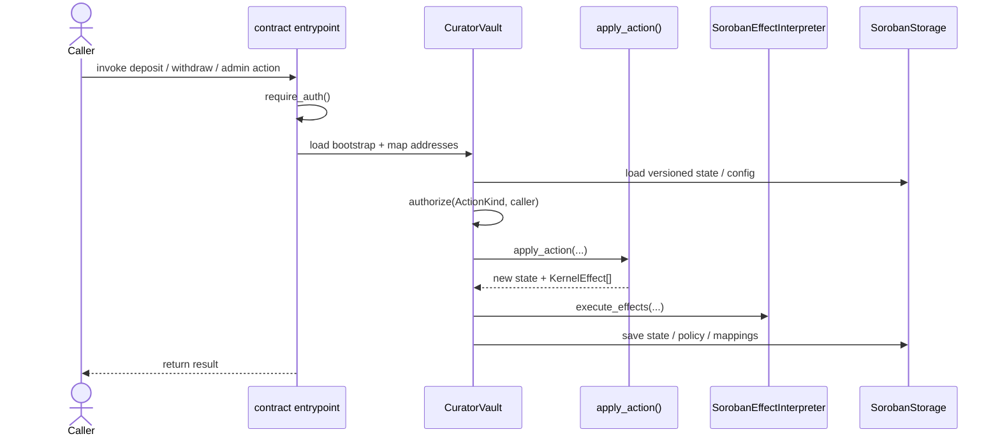
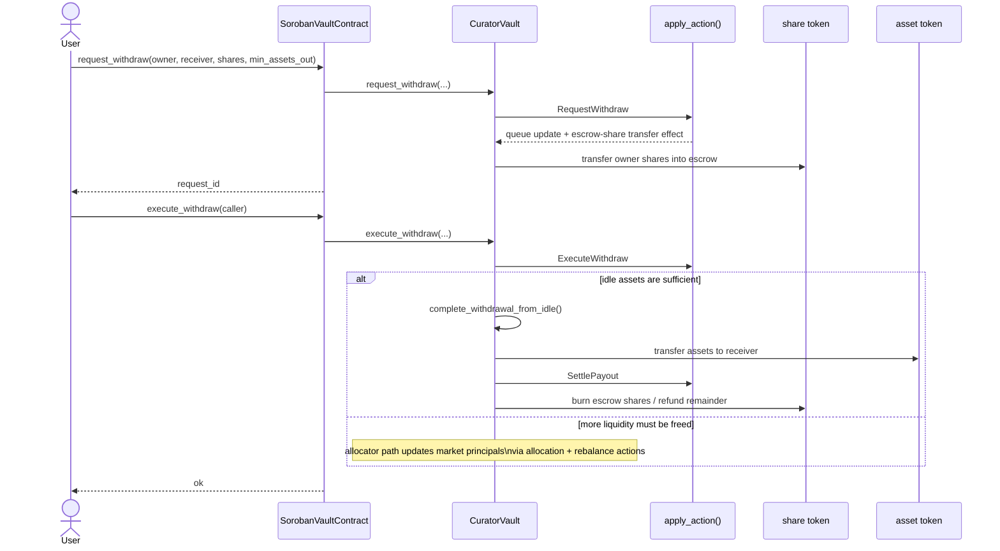

# Soroban Vault Runtime

This crate hosts the Soroban executor/runtime for the Templar vault kernel.

## Runtime Architecture

This crate is the Soroban executor layer for the shared vault kernel. It owns:

- Soroban entrypoints and contract wiring
- address mapping from Soroban addresses to kernel addresses
- persistent state storage and migration gating
- RBAC/auth enforcement via `require_auth()` + shared `ActionKind`
- execution of `KernelEffect`s against Soroban token contracts


### Main Execution Loop



### Soroban-Specific Withdrawal Path



## Prerequisites

### Stellar CLI

The Stellar testnet runs protocol 25, so you need `stellar-cli` v25.  The catch:
v25 requires **Rust 1.89** to compile, but the project toolchain is pinned to
**Rust 1.86** for NEAR contract compatibility.  The solution is to build the CLI
binary with a separate 1.89 toolchain — the resulting binary works regardless of
the project toolchain.

**With devenv** (handles it automatically):

```
devenv shell
```

On first entry, devenv installs Rust 1.89 as a side-by-side toolchain and
builds `stellar-cli` v25.  Subsequent entries skip this (~3-4 min first time).

**Without devenv:**

```
./scripts/install-stellar-cli.sh
```

The script installs Rust 1.89 (via rustup) and builds the CLI.  System
prerequisites:

| OS | Packages |
|----|----------|
| Arch/CachyOS | `pacman -S dbus pkg-config` |
| Ubuntu/Debian | `apt install libdbus-1-dev pkg-config` |
| Fedora | `dnf install dbus-devel pkgconf-pkg-config` |
| macOS | (none — dbus is not needed) |

### Nix / devenv note

The nix environment isolates libraries from the host.  If `stellar` segfaults or
reports `libdbus-1.so.3: cannot open`, ensure `dbus` is in the devenv
`LD_LIBRARY_PATH` (already configured in `devenv.nix`).

## Quick start (testnet)

Use recipes from [contract/vault/soroban/justfile](./justfile):

- `setup`
- `deploy-all`
- `demo-deposit`
- `demo-withdraw`

From repo root: `just -f contract/vault/soroban/justfile <recipe>`.

The build step compiles the WASM and runs `stellar contract optimize` to shrink
it from ~430KB to ~250KB (required to stay under Soroban's transaction limits).

## Blend Adapter

Blend integration lives in the dedicated crate `contract/vault/soroban/blend-adapter`.
Use recipes in [contract/vault/soroban/justfile](./justfile):

- `just build-blend-adapter`
- `just deploy-blend-adapter <BLEND_POOL_ADDRESS>`
- `just deploy-all-with-blend <BLEND_POOL_ADDRESS>`

After deployment, register the adapter as a vault market before allocation.

## Deployment Artifact

The Soroban justfile deploys only the optimized runtime artifact:

- `templar_soroban_runtime.optimized.wasm` (default deploy target)

Useful commands:

- `wasm-path` -> optimized deploy artifact
- `optimized-wasm-path` -> explicit optimized artifact path

## State Size and Operational Limits

- Soroban enforces per-entry and per-transaction resource limits. Current network values are documented by Stellar: https://developers.stellar.org/docs/networks/resource-limits-fees
- Vault runtime state is persisted as a single `StateBlob`, so serialized `VaultState` size is the practical storage-pressure point.
- The main long-lived growth vector is pending withdrawals, which are bounded by `MAX_PENDING = 1024`.
- In-flight operation plans (`Allocating.plan`, `Refreshing.plan`) are expected to remain small under allocator policy, so the 1024 pending-withdrawal cap is the dominant operational bound in practice.

## Practical Risk Model

- TVL growth by itself does not significantly increase serialized state size.
- Risk comes from queue backlog plus unusually large in-flight plans.
- If state exceeds Soroban storage write limits, the transaction fails atomically (no partial state commit).

## Parity Tests

Parity tests check behavioral equivalence across the shared kernel and chain executors (NEAR and Soroban). They ensure state transitions, accounting behavior, and invariants stay aligned as implementations evolve.

- Guide: `contract/vault/README.md#parity-tests`

## Threat Model

- Soroban-specific STRIDE: `contract/vault/soroban/STRIDE.md`

## Share Token Policy

- Soroban share-token transfers are user-authorized (`from.require_auth()`).
- The vault can still transfer shares for internal flows (escrow/payout effects).
