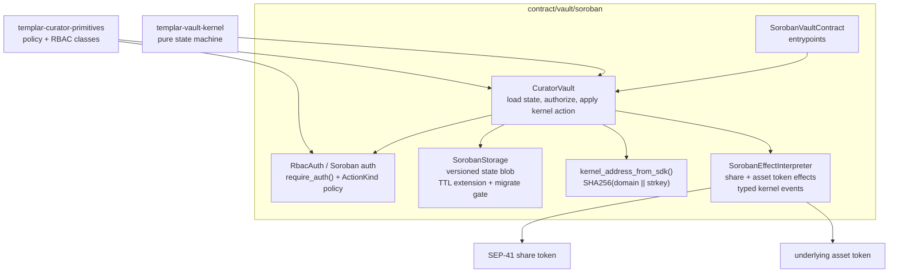
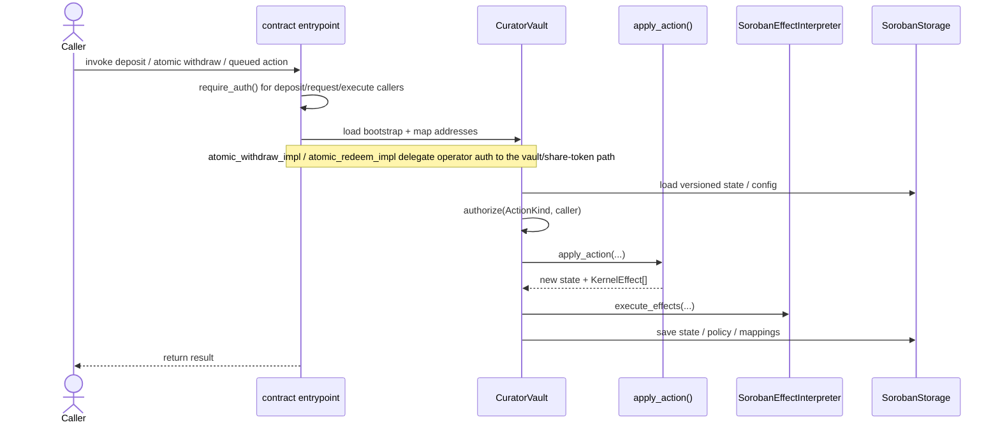

# Soroban Vault Runtime

This crate hosts the Soroban executor/runtime for the Templar vault kernel.

## Runtime Architecture

This crate is the Soroban executor layer for the shared vault kernel. It owns:

- Soroban entrypoints and contract wiring
- address mapping from Soroban addresses to kernel addresses
- persistent state storage and migration gating
- RBAC/auth enforcement via `require_auth()` + shared `ActionKind`
- execution of `KernelEffect`s against Soroban token contracts

Governance timelock/orchestration lives in the dedicated `contract/vault/soroban/governance`
contract. The runtime still applies canonical governance state changes. Vault-bound governance
actions cross the contract boundary via `execute_governance(env, caller, payload)`, where the
payload carries a `GovernanceCommand`. `SetTimelock` and `Other` actions stay local to the
governance contract. The generic `execute(payload)` path remains for user flows and the
`CancelMigration` recovery command. Runtime support for `VIRTUAL_OFFSETS` remains in the retained
config subset and has no shipped governance-contract submitter; allocator and adapter-allowlist
changes are routed through `execute_governance`.



### Main Execution Loop



### Fee Anchor And Idle Balance Accounting

The Soroban vault treats unsolicited underlying transfers as idle assets for existing
shareholders, not as profit that the next depositor can capture. Read-only conversion and preview
helpers first compare the persisted `idle_assets` value with the asset token balance held by the
vault and simulate the reconciled state before quoting shares or assets.

State-changing paths that depend on current share pricing use the same lazy reconciliation rule
before executing kernel actions. `DepositWithMin`, `RefreshFees`, and `ResyncIdleBalance` all read
the live asset token balance, update `idle_assets`, recompute `total_assets`, and reset the
`fee_anchor` to the reconciled total at the current ledger timestamp. This keeps direct transfers,
fee refreshes, and later deposits on one accounting baseline without requiring a separate keeper
transaction before every user deposit.
When fees are active, deposits first crystallize any elapsed management/performance fees before
the post-deposit anchor is written, so deposit principal cannot erase already accrued fees.

### Governance Control-Plane Boundary

- The governance contract owns proposal submission, timelocks, approval/revocation, and abdication.
- The configured Sentinel is a separate emergency role holder. The governance contract is not
  implicitly treated as Sentinel and should not be granted `Role::Sentinel` just to make governance
  proposals work.
- The runtime remains the canonical owner of applied vault config/policy state.
- Vault-bound governance actions cross the boundary through a single bridge:
  `execute_governance(env, caller, payload)`. The payload is a `GovernanceCommand` that the
  runtime decodes and dispatches to the corresponding internal config/policy/state helpers.
- Emergency pause and restriction tightening are immediate Sentinel actions. Unpause and
  relaxing/removing restrictions are governance actions and must pass through the configured
  timelock before the runtime applies them.
- Skim recipient changes and skim execution are governance actions and must pass through the
  configured `Skim` timelock before the runtime applies them.
- `execute(payload)` remains for user flows and the `CancelMigration` recovery command.
  Allocator and adapter-allowlist governance changes use `execute_governance`; `VIRTUAL_OFFSETS`
  remains a runtime governance-config kind without a shipped governance-contract submitter.

### Soroban-Specific Withdrawal Path

The vault intentionally exposes two withdrawal modes:

- `withdraw` / `redeem` are ERC-4626-style atomic exits from idle liquidity only. They never
  enqueue work, never pull from adapters, and fail if the requested assets exceed `idle_assets`.
  Accordingly, the `proxy_view` `maxWithdraw` and `maxRedeem` values are bounded by idle assets
  and can be `0` even when the owner has shares backed by market-deployed assets. This is the
  immediate idle-liquidity exit path when sufficient idle liquidity is available.
- `request_withdraw` is the async path for positions that may require allocator/keeper work.
  `execute_withdraw` advances the queue only when the head request is cooled down and fully
  covered by idle assets; otherwise it fails atomically and leaves the request queued.

The async queue is not a strict FIFO fairness boundary against atomic exits. It coordinates
cooldowns, escrow, fixed asset claims, and allocator-driven liquidity recovery, but it does not
reserve idle assets for queued requests while the vault remains idle. A later holder can still use
atomic `withdraw` / `redeem` against currently idle liquidity before an allocator executes the
queued head. This mirrors the Morpho-style model where immediate idle-liquidity exits are primary
and queued or forced-liquidity paths are recovery/coordination mechanisms rather than global
priority locks.

`request_withdraw` converts the escrowed shares into a fixed `expected_assets` claim at request
time. Execution later pays that stored claim rather than repricing the shares. This protects the
queued withdrawer's requested slippage bound, but it also means later NAV declines are absorbed by
the remaining share supply rather than by the already-queued request. This is an intentional
accounting tradeoff of the queued path and should be considered when setting withdrawal cooldowns,
allocator response processes, and adapter risk limits.

There is no user-callable cancellation path for queued withdrawals in this version. A queued user
can exit only when the request is executed, skipped by policy as a zero/restricted request, or
handled by an authorized recovery action such as `AbortWithdrawing` after execution has entered a
recoverable withdrawal state. Adding `cancel_withdraw(request_id)` is deferred because it needs
explicit FIFO, escrow refund, restriction, pause, and queue-removal semantics.

```mermaid
sequenceDiagram
    actor User
    actor Keeper as Allocator/Keeper
    participant Contract as SorobanVaultContract
    participant Vault as CuratorVault
    participant Kernel as apply_action()
    participant Share as share token
    participant Asset as asset token

    User->>Contract: request_withdraw(owner, receiver, shares, min_assets_out)
    Contract->>Vault: request_withdraw(...)
    Vault->>Kernel: RequestWithdraw
    Kernel-->>Vault: queue update + escrow-share transfer effect
    Vault->>Share: transfer owner shares into escrow
    Contract-->>User: request_id

    Keeper->>Contract: execute_withdraw(caller)
    Contract->>Vault: execute_withdraw(...)
    Vault->>Vault: authorize ActionKind::ExecuteWithdraw
    Vault->>Kernel: ExecuteWithdraw
    alt queue head is cooled down and fully idle-funded
        Vault->>Vault: complete_withdrawal_from_idle()
        Vault->>Asset: transfer assets to receiver
        Vault->>Kernel: SettlePayout
        Vault->>Share: burn escrow shares / refund remainder
    else liquidity must be freed first
        Note over Vault: transaction fails atomically; no partial payout is made\nallocator path must free liquidity before retry
    end
    Contract-->>Keeper: ok
```

`execute_withdraw` is not a public user exit. The Soroban entrypoint requires the caller's
signature and the vault then authorizes the caller under `ActionKind::ExecuteWithdraw`, which is
the allocator policy class in the default RBAC policy. Ordinary users use atomic `withdraw` /
`redeem` for idle liquidity or `request_withdraw` for the queued path.

The typed `execute_withdraw` entrypoint keeps returning `Result<(), _>` for the stable contract
ABI. The generic `execute(payload)` command path returns
`VaultCommandResult::ExecuteWithdrawStatus` for `VaultCommand::ExecuteWithdraw`, with:

- `op_state_before` and `op_state_after`: kernel operation-state codes
  (`0 = Idle`, `1 = Allocating`, `2 = Withdrawing`, `3 = Refreshing`,
  `4 = Payout`).
- `assets_transferred`: assets paid to receivers during this command.
- `events_emitted`: kernel/runtime events emitted while processing the command.

Keepers should treat a failed `ExecuteWithdraw` with the kernel low-liquidity error as a signal to
free market liquidity before retrying. The error is intentionally compact and does not carry
`needed` / `available` amounts; automation should derive the head request's `expected_assets` from
the indexed `WithdrawalRequested` event stream and compare it with the current idle assets exposed
by `proxy_view` before choosing how much liquidity to free. A successful command with
`assets_transferred == 0` and a non-idle `op_state_after` should be alerted as an unexpected
no-progress withdrawal state. The A-002 fix is intended to reject that zero-progress transition
before it is persisted, but the structured result keeps automation from relying on a bare `Unit`
success.

Finishing an allocation does not advance the withdrawal queue. `FinishAllocating` returns the vault
to idle and leaves any queued requests untouched, even when the queue head is cooled down and fully
idle-funded. This keeps allocator redeployment explicit: freed liquidity can be supplied elsewhere,
used by atomic `withdraw` / `redeem`, or paid to a queued request only when an allocator/keeper
separately calls `execute_withdraw`. Off-chain indexers and reconciliation jobs should treat
`execute_withdraw` and the emitted withdrawal / payout events as the settlement trigger for the
async queue.

If withdrawal execution enters `Withdrawing` and cannot progress because idle
liquidity remains below the kernel minimum, an allocator-emergency actor can
submit `VaultCommand::AbortWithdrawing { caller, op_id }` through `execute`.
The command reuses the kernel recovery transition: it validates the active
operation id and queue head, refunds escrowed shares, emits the kernel
`WithdrawalStopped` event, dequeues the request, and returns the vault to
`Idle`.

`AbortWithdrawing` uses the `ActionKind::AbortWithdrawing` authorization class.
In the default Soroban RBAC policy this is available to allocator-emergency
operators (`allocator`, `sentinel`, and `curator`), not ordinary users. The
transition restores any `Withdrawing.collected` amount to idle accounting before
refunding escrowed shares, dequeuing the head request, and returning to `Idle`.

## Prerequisites

### Stellar CLI

The Stellar testnet is on the protocol 26 upgrade path, so use `stellar-cli`
v26. The workspace toolchain is **Rust 1.92** because the current Stellar CLI
and OpenZeppelin Stellar crates require it.

**With devenv** (handles it automatically):

```
devenv shell
```

On first entry, devenv installs Rust 1.92 and builds `stellar-cli` v26.
Subsequent entries skip this (~3-4 min first time).

**Without devenv:**

```
./scripts/install-stellar-cli.sh
```

The script installs Rust 1.92 (via rustup) and builds the CLI. The optimized
contract build path requires the CLI's default native integrations, so Linux
hosts need dbus development headers:

| OS | Packages |
|----|----------|
| Arch/CachyOS | `pacman -S dbus systemd pkg-config` |
| Ubuntu/Debian | `apt install libdbus-1-dev libudev-dev pkg-config` |
| Fedora | `dnf install dbus-devel systemd-devel pkgconf-pkg-config` |
| macOS | (none — dbus is not needed) |

### Nix / devenv note

The nix environment isolates libraries from the host.  If `stellar` segfaults or
reports `libdbus-1.so.3: cannot open`, ensure `dbus` is in the devenv
`LD_LIBRARY_PATH` (already configured in `devenv.nix`).

## Quick start (testnet)

Use recipes from [contract/vault/soroban/justfile](./justfile):

- `setup`
- `deploy-all`
- `demo-deposit`
- `demo-withdraw`

From repo root: `just -f contract/vault/soroban/justfile <recipe>`.

The build step compiles the runtime, governance, and share-token WASMs, runs the Stellar optimizer,
and strips runtime contractspec metadata into a deploy artifact. The runtime deploy artifact is
budgeted separately from the optimizer output because it is the artifact used for size gating.

## Blend Adapter

Blend integration lives in the dedicated crate `contract/vault/soroban/blend-adapter`.
Use recipes in [contract/vault/soroban/justfile](./justfile):

- `just build-blend-adapter`
- `just deploy-blend-adapter <BLEND_POOL_ADDRESS>`
- `just deploy-all-with-blend <BLEND_POOL_ADDRESS>`

After deployment, register the adapter as a vault market before allocation.

## Market Adapter Approaches

Vault allocations into Templar-specific markets can use either a custodial forwarding adapter or the
onchain HOT bridge adapter.

### Custodial / Multisig Adapter

A forwarding adapter sends allocated assets to a multisig or address controlled by the operator. The
operator then handles the HOT/Intents bridge and Templar market deposit offchain.

Supply flow:

```text
allocate
-> market adapter
-> operator multisig/address
-> operator infra bridges/deposits via HOT / Intents
-> Templar market
```

Withdrawal flow:

```text
operator infra exits/unwinds the Templar market position offchain
-> operator bridges/returns funds back to the adapter
-> funds sit as idle liquidity in the adapter
-> vault withdraws idle liquidity from the adapter
```

In this model, a vault withdrawal only withdraws idle liquidity already present in the adapter. The
operator is responsible for making that liquidity available first by unwinding the market position and
returning funds. There is no automatic onchain market-exit step in the adapter.

### Onchain HOT Bridge Adapter

The HOT bridge adapter automatically routes the vault allocation through HOT. The bridged assets land
in the Templar counterparty contract, and the counterparty forwards into the configured Templar
market.

Supply flow:

```text
allocate
-> HOT bridge adapter
-> HOT / Intents bridge
-> Templar counterparty
-> Templar market
```

Withdrawal flow:

```text
vault requests withdrawal from HOT bridge adapter
-> Templar counterparty exits/advances the market withdrawal flow
-> counterparty receives the withdrawn Intents/HOT asset
-> counterparty initiates HOT withdrawal back to Stellar
-> HOT bridge returns funds to the Stellar-side adapter
-> adapter releases returned funds back to the vault
```

This is more automated, but the withdrawal path has more moving parts. The Soroban adapter can
observe funds once they return on Stellar, but it cannot cryptographically prove the NEAR-side
settlement caused that return. This uses the same broad HOT/Intents bridge trust model already used
for Stellar deposits into Templar markets; the difference is whether operator infra or the onchain
adapter/counterparty owns routing and market-forwarding/withdrawal steps.

## HOT Bridge Adapter

HOT bridge integration lives in `contract/vault/soroban/hot-bridge-adapter`. It exposes the same
Soroban market-adapter surface as Blend (`supply`, `progress_withdrawal`, `total_assets`) while
routing supplied assets into the HOT Stellar locker.

Use recipes in [contract/vault/soroban/justfile](./justfile):

- `just build-hot-bridge-adapter`
- `HOT_STELLAR_LOCKER_CONTRACT=<contract> HOT_STELLAR_RECEIVER_HEX=<64 hex chars> just deploy-hot-bridge-adapter`
- `just hot-bridge-adapter-status`

`HOT_STELLAR_RECEIVER_HEX` is intentionally explicit. It should be copied from a proven HOT receiver
for the NEAR counterparty, not recomputed locally during deployment.

`deploy-hot-bridge-adapter` pins the production HOT Stellar locker by contract ID and fetched WASM
SHA-256 before deploying. For non-production testing only, set `HOT_STELLAR_LOCKER_ALLOW_UNPINNED=1`
and override `HOT_STELLAR_LOCKER_EXPECTED_WASM_SHA256` for the test locker.

Withdrawal settlement is observable on Soroban only when returned Stellar-side token balance reaches
the adapter. Without a NEAR/HOT proof verifier, operators must treat the HOT bridge/relayer path as a
trusted settlement dependency before calling `progress_withdrawal`.

## Deployment Artifact

The Soroban justfile builds two runtime artifacts:

- `templar_soroban_runtime.wasm` with Stellar optimizer output and contractspec metadata
- `templar_soroban_runtime.deploy.wasm` with contractspec metadata stripped for deployment and
  size-budget checks

Useful commands:

- `wasm-path` -> default runtime artifact, currently `templar_soroban_runtime.wasm`
- `optimized-wasm-path` -> explicit optimized artifact path
- `deploy-wasm-path` -> contractspec-stripped deploy artifact path used for deployment and size verification
- `size-budget-check` -> verifies `templar_soroban_runtime.deploy.wasm <= 131072` bytes

## State Size and Operational Limits

- Soroban enforces per-entry and per-transaction resource limits. Current network values are documented by Stellar: https://developers.stellar.org/docs/networks/resource-limits-fees
- Vault runtime state is persisted as a compact versioned `StateBlob` header plus domain-paged withdrawal queue entries. Each `wqpage` stores up to 128 pending withdrawals, so the queue can use the kernel `MAX_PENDING = 1024` cap without coupling the whole queue to one 64 KiB storage entry.
- Restrictions and policy blobs use the generic blob-paging transport. Small payloads are stored inline; larger payloads are split into bounded 32 KiB pages.
- One contract invocation is still bounded by Soroban transaction resource limits. Very large sanctions-list style updates should use a batched governance/update flow instead of one giant replacement payload.
- In-flight operation plans (`Allocating.plan`, `Refreshing.plan`) are expected to remain small under allocator policy; if that assumption changes, the paged blob transport protects storage entry size but not per-transaction CPU/write-byte budgets.
- Persistent storage blobs carry a compact `TVS` version header. Decoders reject pre-header bytes and unsupported versions; schema upgrades should add explicit per-version decode/migration dispatch before any layout change.

## Practical Risk Model

- TVL growth by itself does not significantly increase serialized state size.
- Risk comes from queue backlog plus unusually large in-flight plans.
- If state would exceed Soroban storage write limits, storage save paths return a typed runtime storage error before the host storage write.

## Runtime TTL and Keeper Responsibility

Soroban contract data is not permanent. Vault deployments must include an ops/keeper job that
periodically calls the permissionless `VaultCommand::ExtendTtl` path through `execute(payload)`.
Do not rely on a curator remembering to do this manually.

The runtime TTL keeper renews the vault contract's own storage, not every external contract or
every user-owned entry elsewhere. In particular, one successful vault runtime TTL call renews:

- runtime instance storage;
- the canonical `StateBlob`, including any paged blob entries;
- policy and restriction blobs: `PolicyLocks`, `PolicySupplyQueue`, `PolicyMarkets`,
  `PolicyPrincipals`, `PolicyCapGroups`, and `Restrictions`, including their paged entries;
- withdrawal queue pages currently referenced by the state header;
- runtime address-book mappings referenced by pending withdrawals, active withdrawal/payout
  operation state, and fee recipients.

Normal state-saving vault paths also refresh runtime storage TTL, but a quiet vault can still
approach archival. Schedule the keeper on cadence well before the TTL threshold. Related contracts
need their own TTL maintenance: share token, governance, adapters, proxy contracts, and oracle
contracts do not inherit the vault runtime's TTL renewal. Vault governance and the 4626 proxy
each have their own permissionless `extend_ttl()` entrypoint for config/proposal-state
maintenance.

## Parity Tests

Parity tests check behavioral equivalence across the shared kernel and chain executors (NEAR and Soroban). They ensure state transitions, accounting behavior, and invariants stay aligned as implementations evolve.

- Guide: `contract/vault/README.md#parity-tests`

## Threat Model

- Soroban-specific STRIDE: `contract/vault/soroban/STRIDE.md`

## Share Token Policy

- Soroban share-token transfers are user-authorized (`from.require_auth()`).
- The vault can still transfer shares for internal flows (escrow/payout effects).

## Share Token TTL and Archival Recovery

- Share-token instance storage is refreshed by every public share-token entrypoint, including SEP-41 read-only methods (`total_supply`, `balance`, `allowance`, `decimals`, `name`, and `symbol`) and the custom `admin` / `vault` getters.
- The admin-only `extend_ttl(caller)` entrypoint is the explicit keeper path for proactive instance maintenance. Operators should schedule it well before the instance reaches the TTL threshold; if the instance is archived, restore the contract instance through the Stellar/Soroban archival restore flow first, then call `extend_ttl` as the configured admin.
- Per-holder balances are persistent entries owned by the upstream `stellar-tokens` implementation. Balance reads and balance-changing writes refresh the specific holder balance that is touched; the share token intentionally does not maintain an enumerable holder index or perform unbounded global balance refreshes from `extend_ttl`.
- Allowances are temporary entries bounded by their explicit `live_until_ledger`. They are not extended beyond that caller-selected expiry by the share-token keeper path; owners should renew approvals when continued delegated spending is desired.
