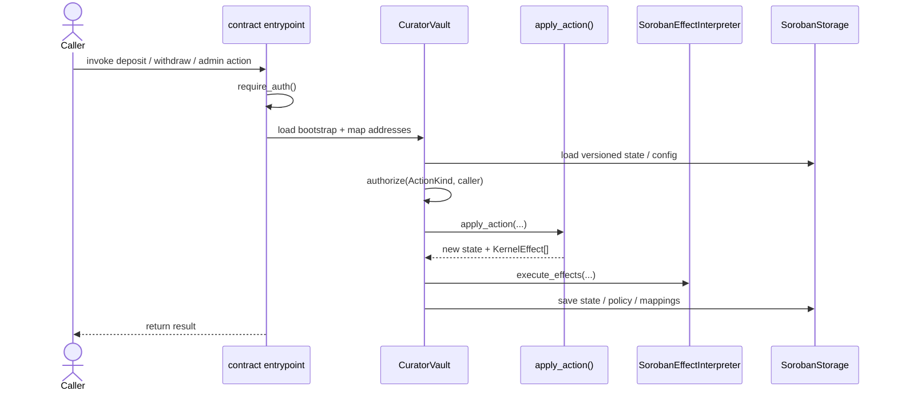
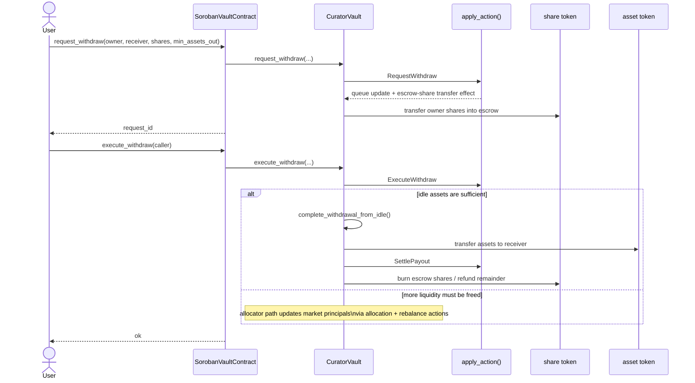

# Soroban Vault Runtime

This crate hosts the Soroban executor/runtime for the Templar vault kernel.

## Runtime Architecture

This crate is the Soroban executor layer for the shared vault kernel. It owns:

- Soroban entrypoints and contract wiring
- address mapping from Soroban addresses to kernel addresses
- persistent state storage and migration gating
- RBAC/auth enforcement via `require_auth()` + shared `ActionKind`
- execution of `KernelEffect`s against Soroban token contracts

Governance timelock/orchestration lives in the dedicated `contract/vault/soroban/governance`
contract. The runtime still applies canonical governance state changes. Vault-bound governance
actions cross the contract boundary via `execute_governance(env, caller, payload)`, where the
payload carries a `GovernanceCommand`. `SetTimelock` and `Other` actions stay local to the
governance contract. The generic `execute(payload)` path remains for user flows and the
`CancelMigration` recovery command. Runtime support for `VIRTUAL_OFFSETS` remains in the retained
config subset and has no shipped governance-contract submitter; allocator and adapter-allowlist
changes are routed through `execute_governance`.


### Main Execution Loop



### Governance Control-Plane Boundary

- The governance contract owns proposal submission, timelocks, approval/revocation, and abdication.
- The configured Sentinel is a separate emergency role holder. The governance contract is not
  implicitly treated as Sentinel and should not be granted `Role::Sentinel` just to make governance
  proposals work.
- The runtime remains the canonical owner of applied vault config/policy state.
- Vault-bound governance actions cross the boundary through a single bridge:
  `execute_governance(env, caller, payload)`. The payload is a `GovernanceCommand` that the
  runtime decodes and dispatches to the corresponding internal config/policy/state helpers.
- Emergency pause and restriction tightening are immediate Sentinel actions. Unpause and
  relaxing/removing restrictions are governance actions and must pass through the configured
  timelock before the runtime applies them.
- Skim recipient changes and skim execution are governance actions and must pass through the
  configured `Skim` timelock before the runtime applies them.
- `execute(payload)` remains for user flows and the `CancelMigration` recovery command.
  Allocator and adapter-allowlist governance changes use `execute_governance`; `VIRTUAL_OFFSETS`
  remains a runtime governance-config kind without a shipped governance-contract submitter.

### Soroban-Specific Withdrawal Path



The typed `execute_withdraw` entrypoint keeps returning `Result<(), _>` for
the stable contract ABI. The generic `execute(payload)` command path returns
`VaultCommandResult::ExecuteWithdrawStatus` for
`VaultCommand::ExecuteWithdraw`, with:

- `op_state_before` and `op_state_after`: kernel operation-state codes
  (`0 = Idle`, `1 = Allocating`, `2 = Withdrawing`, `3 = Refreshing`,
  `4 = Payout`).
- `assets_transferred`: assets paid to receivers during this command.
- `events_emitted`: kernel/runtime events emitted while processing the command.

Keepers should treat a failed `ExecuteWithdraw` with the kernel low-liquidity
error as a signal to free market liquidity before retrying. A successful
command with `assets_transferred == 0` and a non-idle `op_state_after` should
be alerted as an unexpected no-progress withdrawal state. The A-002 fix is
intended to reject that zero-progress transition before it is persisted, but the
structured result keeps automation from relying on a bare `Unit` success.

If withdrawal execution enters `Withdrawing` and cannot progress because idle
liquidity remains below the kernel minimum, an allocator-emergency actor can
submit `VaultCommand::AbortWithdrawing { caller, op_id }` through `execute`.
The command reuses the kernel recovery transition: it validates the active
operation id and queue head, refunds escrowed shares, emits the kernel
`WithdrawalStopped` event, dequeues the request, and returns the vault to
`Idle`.

`AbortWithdrawing` uses the `ActionKind::AbortWithdrawing` authorization class.
In the default Soroban RBAC policy this is available to allocator-emergency
operators (`allocator`, `sentinel`, and `curator`), not ordinary users. The
transition restores any `Withdrawing.collected` amount to idle accounting before
refunding escrowed shares, dequeuing the head request, and returning to `Idle`.

## Prerequisites

### Stellar CLI

The Stellar testnet is on the protocol 26 upgrade path, so use `stellar-cli`
v26. The workspace toolchain is **Rust 1.92** because the current Stellar CLI
and OpenZeppelin Stellar crates require it.

**With devenv** (handles it automatically):

```
devenv shell
```

On first entry, devenv installs Rust 1.92 and builds `stellar-cli` v26.
Subsequent entries skip this (~3-4 min first time).

**Without devenv:**

```
./scripts/install-stellar-cli.sh
```

The script installs Rust 1.92 (via rustup) and builds the CLI. The optimized
contract build path requires the CLI's default native integrations, so Linux
hosts need dbus development headers:

| OS | Packages |
|----|----------|
| Arch/CachyOS | `pacman -S dbus pkg-config` |
| Ubuntu/Debian | `apt install libdbus-1-dev pkg-config` |
| Fedora | `dnf install dbus-devel pkgconf-pkg-config` |
| macOS | (none — dbus is not needed) |

### Nix / devenv note

The nix environment isolates libraries from the host.  If `stellar` segfaults or
reports `libdbus-1.so.3: cannot open`, ensure `dbus` is in the devenv
`LD_LIBRARY_PATH` (already configured in `devenv.nix`).

## Quick start (testnet)

Use recipes from [contract/vault/soroban/justfile](./justfile):

- `setup`
- `deploy-all`
- `demo-deposit`
- `demo-withdraw`

From repo root: `just -f contract/vault/soroban/justfile <recipe>`.

The build step compiles the runtime, governance, and share-token WASMs, runs the Stellar optimizer,
and strips runtime contractspec metadata into a deploy artifact. The runtime deploy artifact is
budgeted separately from the optimizer output because it is the artifact used for size gating.

## Blend Adapter

Blend integration lives in the dedicated crate `contract/vault/soroban/blend-adapter`.
Use recipes in [contract/vault/soroban/justfile](./justfile):

- `just build-blend-adapter`
- `just deploy-blend-adapter <BLEND_POOL_ADDRESS>`
- `just deploy-all-with-blend <BLEND_POOL_ADDRESS>`

After deployment, register the adapter as a vault market before allocation.

## Deployment Artifact

The Soroban justfile builds two runtime artifacts:

- `templar_soroban_runtime.wasm` with Stellar optimizer output and contractspec metadata
- `templar_soroban_runtime.deploy.wasm` with contractspec metadata stripped for deployment and
  size-budget checks

Useful commands:

- `wasm-path` -> default runtime artifact, currently `templar_soroban_runtime.wasm`
- `optimized-wasm-path` -> explicit optimized artifact path
- `deploy-wasm-path` -> contractspec-stripped deploy artifact path used for deployment and size verification
- `size-budget-check` -> verifies `templar_soroban_runtime.deploy.wasm <= 131072` bytes

## State Size and Operational Limits

- Soroban enforces per-entry and per-transaction resource limits. Current network values are documented by Stellar: https://developers.stellar.org/docs/networks/resource-limits-fees
- Vault runtime state is persisted as a single `StateBlob`, so serialized `VaultState` size is the practical storage-pressure point.
- The main long-lived growth vector is pending withdrawals, which are bounded by `MAX_PENDING = 1024`.
- In-flight operation plans (`Allocating.plan`, `Refreshing.plan`) are expected to remain small under allocator policy, so the 1024 pending-withdrawal cap is the dominant operational bound in practice.

## Practical Risk Model

- TVL growth by itself does not significantly increase serialized state size.
- Risk comes from queue backlog plus unusually large in-flight plans.
- If state exceeds Soroban storage write limits, the transaction fails atomically (no partial state commit).

## Parity Tests

Parity tests check behavioral equivalence across the shared kernel and chain executors (NEAR and Soroban). They ensure state transitions, accounting behavior, and invariants stay aligned as implementations evolve.

- Guide: `contract/vault/README.md#parity-tests`

## Threat Model

- Soroban-specific STRIDE: `contract/vault/soroban/STRIDE.md`

## Share Token Policy

- Soroban share-token transfers are user-authorized (`from.require_auth()`).
- The vault can still transfer shares for internal flows (escrow/payout effects).
