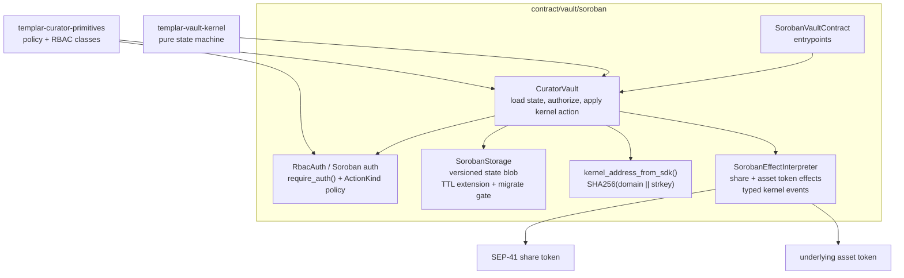
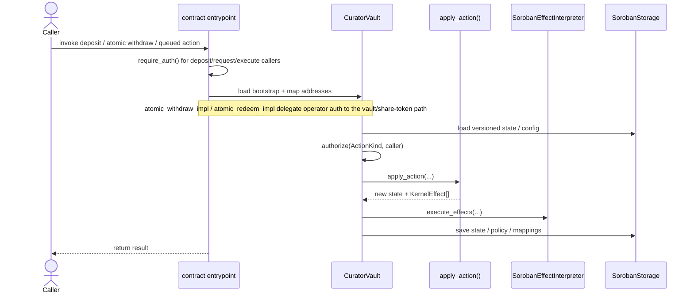

# Soroban Vault Runtime

This crate hosts the Soroban executor/runtime for the Templar vault kernel.

## Runtime Architecture

This crate is the Soroban executor layer for the shared vault kernel. It owns:

- Soroban entrypoints and contract wiring
- address mapping from Soroban addresses to kernel addresses
- persistent state storage and migration gating
- RBAC/auth enforcement via `require_auth()` + shared `ActionKind`
- execution of `KernelEffect`s against Soroban token contracts

Governance timelock/orchestration lives in the dedicated `contract/vault/soroban/governance`
contract. The runtime still applies canonical governance state changes. Vault-bound governance
actions cross the contract boundary via `execute_governance(env, caller, payload)`, where the
payload carries a `GovernanceCommand`. `SetTimelock` and `Other` actions stay local to the
governance contract. The generic `execute(payload)` path remains for user flows and the
`CancelMigration` recovery command. Runtime support for `VIRTUAL_OFFSETS` remains in the retained
config subset and has no shipped governance-contract submitter; allocator and adapter-allowlist
changes are routed through `execute_governance`.


```mermaid
graph TB
    subgraph Contract["contract/vault/soroban"]
        ENTRY["SorobanVaultContract\nentrypoints"]
        CVAULT["CuratorVault<S, A, E>\nload state, authorize, apply kernel action"]
        AUTH["RbacAuth / Soroban auth\nrequire_auth() + ActionKind policy"]
        STORAGE["SorobanStorage\nversioned state blob\nTTL extension + migrate gate"]
        ADDR["kernel_address_from_sdk()\nSHA256(domain || strkey)"]
EFFECTS["SorobanEffectInterpreter\nshare + asset token effects\ntyped kernel events"]

        ENTRY --> CVAULT
        CVAULT --> AUTH
        CVAULT --> STORAGE
        CVAULT --> ADDR
        CVAULT --> EFFECTS
    end

    KERNEL["templar-vault-kernel\npure state machine"] --> CVAULT
    PRIMS["templar-curator-primitives\npolicy + RBAC classes"] --> AUTH
    PRIMS --> CVAULT
    EFFECTS --> SHARE["SEP-41 share token"]
    EFFECTS --> ASSET["underlying asset token"]
```

### Main Execution Loop


```mermaid
sequenceDiagram
    actor Caller
    participant Entry as contract entrypoint
    participant Vault as CuratorVault
    participant Kernel as apply_action()
    participant Interp as SorobanEffectInterpreter
    participant Storage as SorobanStorage

    Caller->>Entry: invoke deposit / atomic withdraw / queued action
    Entry->>Entry: require_auth() for deposit/request/execute callers
    Entry->>Vault: load bootstrap + map addresses
    Note over Entry,Vault: atomic_withdraw_impl / atomic_redeem_impl delegate operator auth to the vault/share-token path
    Vault->>Storage: load versioned state / config
    Vault->>Vault: authorize(ActionKind, caller)
    Vault->>Kernel: apply_action(...)
    Kernel-->>Vault: new state + KernelEffect[]
    Vault->>Interp: execute_effects(...)
    Vault->>Storage: save state / policy / mappings
    Entry-->>Caller: return result
```

### Fee Anchor And Idle Balance Accounting

The Soroban vault treats unsolicited underlying transfers as idle assets for existing
shareholders, not as profit that the next depositor can capture. Read-only conversion and preview
helpers first compare the persisted `idle_assets` value with the asset token balance held by the
vault and simulate the reconciled state before quoting shares or assets.

State-changing paths that depend on current share pricing use the same lazy reconciliation rule
before executing kernel actions. `DepositWithMin`, `RefreshFees`, and `ResyncIdleBalance` all read
the live asset token balance, update `idle_assets`, recompute `total_assets`, and reset the
`fee_anchor` to the reconciled total at the current ledger timestamp. This keeps direct transfers,
fee refreshes, and later deposits on one accounting baseline without requiring a separate keeper
transaction before every user deposit.
When fees are active, deposits first crystallize any elapsed management/performance fees before
the post-deposit anchor is written, so deposit principal cannot erase already accrued fees.

### Governance Control-Plane Boundary

- The governance contract owns proposal submission, timelocks, approval/revocation, and abdication.
- The configured Sentinel is a separate emergency role holder. The governance contract is not
  implicitly treated as Sentinel and should not be granted `Role::Sentinel` just to make governance
  proposals work.
- The runtime remains the canonical owner of applied vault config/policy state.
- Vault-bound governance actions cross the boundary through a single bridge:
  `execute_governance(env, caller, payload)`. The payload is a `GovernanceCommand` that the
  runtime decodes and dispatches to the corresponding internal config/policy/state helpers.
- Emergency pause and restriction tightening are immediate Sentinel actions. Unpause and
  relaxing/removing restrictions are governance actions and must pass through the configured
  timelock before the runtime applies them.
- Skim recipient changes and skim execution are governance actions and must pass through the
  configured `Skim` timelock before the runtime applies them.
- `execute(payload)` remains for user flows and the `CancelMigration` recovery command.
  Allocator and adapter-allowlist governance changes use `execute_governance`; `VIRTUAL_OFFSETS`
  remains a runtime governance-config kind without a shipped governance-contract submitter.

### Soroban-Specific Withdrawal Path

The vault intentionally exposes two withdrawal modes:

- `withdraw` / `redeem` are ERC-4626-style atomic exits from idle liquidity only. They never
  enqueue work, never pull from adapters, and fail if the requested assets exceed `idle_assets`.
  Accordingly, the `proxy_view` `maxWithdraw` and `maxRedeem` values are bounded by idle assets
  and can be `0` even when the owner has shares backed by market-deployed assets. This is the
  immediate idle-liquidity exit path when sufficient idle liquidity is available.
- `request_withdraw` is the async path for positions that may require allocator/keeper work.
  `execute_withdraw` advances the queue only when the head request is cooled down and fully
  covered by idle assets; otherwise it fails atomically and leaves the request queued.

The ERC-4626 proxy exposes the immediate path through `atomic_withdraw` and `atomic_redeem`,
including `max_shares_burned` and `min_assets_out` slippage guards. Its existing `withdraw` and
`redeem` compatibility methods remain queued ERC-7540-style requests; callers that need an
immediate idle-liquidity exit must use the explicit atomic methods.

The async queue is not a strict FIFO fairness boundary against atomic exits. It coordinates
cooldowns, escrow, fixed asset claims, and allocator-driven liquidity recovery, but it does not
reserve idle assets for queued requests while the vault remains idle. A later holder can still use
atomic `withdraw` / `redeem` against currently idle liquidity before an allocator executes the
queued head. This mirrors the Morpho-style model where immediate idle-liquidity exits are primary
and queued or forced-liquidity paths are recovery/coordination mechanisms rather than global
priority locks.

`request_withdraw` converts the escrowed shares into a fixed `expected_assets` claim at request
time. Execution later pays that stored claim rather than repricing the shares. This protects the
queued withdrawer's requested slippage bound, but it also means later NAV declines are absorbed by
the remaining share supply rather than by the already-queued request. This is an intentional
accounting tradeoff of the queued path and should be considered when setting withdrawal cooldowns,
allocator response processes, and adapter risk limits.

When either fee slot is active, `request_withdraw` first crystallizes accrued
management and performance fees before it prices and persists the request's
`expected_assets` claim, using the same lazy fee refresh that guards atomic exits
and deposits. The queued claim is therefore always computed against the post-fee
share supply and conversion rate, so a queued request cannot capture value that
fee crystallization would assign to fee recipients, even when the request drains
the requester's entire share balance. Fees that keep accruing after the request
timestamp are not settled against that fixed claim today: only fee-recipient
crediting occurs after request time, and settling post-request fees at a
settlement boundary is the pending ENG-697 epoch-settlement work.

Redemption conversions use the lower of the configured virtual-offset quote and
the holder's real-asset pro-rata value, while deposit and mint pricing keeps the
configured virtual basis. Virtual offsets can defend deposits against donation
attacks, but cannot make queued or atomic exits consume assets that back the
remaining real shares.

Upgrade migration fails closed when a vault with configured virtual assets has
pending withdrawals. Operators must settle the existing fixed claims before
upgrading because their request-time real-asset basis cannot be reconstructed
safely from current state.

There is no user-callable cancellation path for queued withdrawals in this version. A queued user
can exit only when the request is executed, skipped by policy as a zero/restricted request, or
handled by an authorized recovery action such as `AbortWithdrawing` after execution has entered a
recoverable withdrawal state. Adding `cancel_withdraw(request_id)` is deferred because it needs
explicit FIFO, escrow refund, restriction, pause, and queue-removal semantics.

```mermaid
sequenceDiagram
    actor User
    actor Keeper as Allocator/Keeper
    participant Contract as SorobanVaultContract
    participant Vault as CuratorVault
    participant Kernel as apply_action()
    participant Share as share token
    participant Asset as asset token

    User->>Contract: request_withdraw(owner, receiver, shares, min_assets_out)
    Contract->>Vault: request_withdraw(...)
    Vault->>Kernel: RequestWithdraw
    Kernel-->>Vault: queue update + escrow-share transfer effect
    Vault->>Share: transfer owner shares into escrow
    Contract-->>User: request_id

    Keeper->>Contract: execute_withdraw(caller)
    Contract->>Vault: execute_withdraw(...)
    Vault->>Vault: authorize ActionKind::ExecuteWithdraw
    Vault->>Kernel: ExecuteWithdraw
    alt queue head is cooled down and fully idle-funded
        Vault->>Vault: complete_withdrawal_from_idle()
        Vault->>Asset: transfer assets to receiver
        Vault->>Kernel: SettlePayout
        Vault->>Share: burn escrow shares / refund remainder
    else liquidity must be freed first
        Note over Vault: transaction fails atomically; no partial payout is made\nallocator path must free liquidity before retry
    end
    Contract-->>Keeper: ok
```

`execute_withdraw` is not a public user exit. The Soroban entrypoint requires the caller's
signature and the vault then authorizes the caller under `ActionKind::ExecuteWithdraw`, which is
the allocator policy class in the default RBAC policy. Ordinary users use atomic `withdraw` /
`redeem` for idle liquidity or `request_withdraw` for the queued path.

The typed entrypoints keep returning their stable contract ABI values. The generic
`execute(payload)` command path returns compact typed receipt bytes:

| Command | Receipt |
|---|---|
| `DepositWithMin` | `DepositReceipt { shares_out: i128 }` |
| `RequestWithdraw` | `RequestWithdrawReceipt { request_id: u64, shares_escrowed: i128 }` |
| `ExecuteWithdraw` | `ExecuteWithdrawReceipt` |
| `AtomicWithdraw`, `AtomicRedeem`, `Allocate`, `RefreshMarkets` | `I128Receipt { value: i128 }` |
| `AbortWithdrawing`, `RefreshFees`, `ResyncIdleBalance`, `CancelMigration`, `ExtendTtl` | `EmptyReceipt` |

`VaultCommand::ExecuteWithdraw` returns `ExecuteWithdrawReceipt` with:

- tag `0`: `ExecuteWithdrawReceipt::NoPayout { status }`.
- tag `1`: `ExecuteWithdrawReceipt::Completed { request_id, owner, receiver, assets_out,
  shares_burned, status }`, where `assets_out` and `shares_burned` are unsigned asset/share
  amounts.

Both receipt variants include `status`, which carries `op_state_before`, `op_state_after`,
`assets_transferred`, and `events_emitted` for keeper diagnostics.

Keepers should treat a failed `ExecuteWithdraw` with the kernel low-liquidity error as a signal to
free market liquidity before retrying. The error is intentionally compact and does not carry
`needed` / `available` amounts; automation should derive the head request's `expected_assets` from
the indexed `WithdrawalRequested` event stream and compare it with the current idle assets exposed
by `proxy_view` before choosing how much liquidity to free. A `NoPayout` receipt means no request
settled and should be handled as a signal to free liquidity and retry once the head can be covered.
A `Completed` receipt with `assets_out == 0` is an unexpected no-progress state and should be
alerted. The A-002 fix is intended to reject zero-progress transitions before they are persisted,
so automation should not rely on a bare `Unit` success from the typed entrypoint.

Finishing an allocation does not advance the withdrawal queue. `FinishAllocating` returns the vault
to idle and leaves any queued requests untouched, even when the queue head is cooled down and fully
idle-funded. This keeps allocator redeployment explicit: freed liquidity can be supplied elsewhere,
used by atomic `withdraw` / `redeem`, or paid to a queued request only when an allocator/keeper
separately calls `execute_withdraw`. Off-chain indexers and reconciliation jobs should treat
`execute_withdraw` and the emitted withdrawal / payout events as the settlement trigger for the
async queue.

### Supply Admission And Observation Re-Validation

Every supply path — the typed `Allocate` entrypoint, `VaultCommand::Allocate`, and the internal
curator allocation flow — is checked before any asset transfer or adapter call, and checked again
after the adapter reports. Supply is admitted only when all of the following hold:

- the market is configured and enabled;
- the market is currently a member of the governance-configured supply queue;
- the principal after the request stays within the market cap;
- the market's cap group, if any, still has headroom under both its absolute cap and its relative
  cap, where the relative cap is applied to the pre-allocation `total_assets` snapshot and the
  group check counts the cumulative principal of every market in that group.

After the adapter call, the reported total assets must stay within the active allocation step and
must satisfy the same market and cap-group limits before any principal or accounting state is
persisted. A violation returns `ContractError::InvalidState`, so the whole Soroban transaction
reverts and token balances, adapter state, policy principals, and kernel accounting are unchanged.
Measuring the group limits against the pre-allocation snapshot keeps an adapter from enlarging the
denominator of a relative cap during the same allocation it is supposed to be bounded by, and
re-checking after the call means the limit holds even if the adapter or a policy change makes the
pre-request decision stale.

Disabling supply for a market — by disabling it, setting its cap to zero, or removing it from the
supply queue — blocks further supply while leaving that market's existing adapter binding in
place, so withdrawals already deployed against that market keep settling through the same
adapter.

If withdrawal execution enters `Withdrawing` and cannot progress because idle
liquidity remains below the kernel minimum, an allocator-emergency actor can
submit `VaultCommand::AbortWithdrawing { caller, op_id }` through `execute`.
The command reuses the kernel recovery transition: it validates the active
operation id and queue head, refunds escrowed shares, emits the kernel
`WithdrawalStopped` event, dequeues the request, and returns the vault to
`Idle`.

`AbortWithdrawing` uses the `ActionKind::AbortWithdrawing` authorization class.
In the default Soroban RBAC policy this is available to allocator-emergency
operators (`allocator`, `sentinel`, and `curator`), not ordinary users. The
transition restores any `Withdrawing.collected` amount to idle accounting before
refunding escrowed shares, dequeuing the head request, and returning to `Idle`.

### Refresh Observation Validation

Refresh stages all selected adapter observations before synchronizing kernel accounting or
persisting policy. Each observation must name a configured market and stay within that market's
cap, and the aggregate of current `idle_assets` plus final staged `external_assets` must not
overflow. A violation returns `ContractError::InvalidState` and rolls back the entire public
refresh, including adapter transaction state.

Refresh reports actual exposure; it does not gate it. Absolute and relative group caps are supply
admission controls: they decide whether new supply may be deployed, not whether a gain or loss the
adapters already observed may be recognised. Booked group principals can therefore sit above
`min(absolute_cap, floor(relative_cap * total_assets))` after an out-of-group loss, after a
permissionless withdrawal shrinks the denominator, or after governance tightens a cap. Observation
alone is not authenticated by caps — refresh never proves that reported assets exist.

Group principals are recorded from the final staged state, so a repeated market observation
retains its last value.

While a group sits over cap, new supply to any of its markets is refused with
`ContractError::InvalidState` before any transfer, and withdrawals that reduce exposure keep
working; the group becomes admissible again as soon as its principal falls back under the cap.

Existing exposure in disabled or unqueued markets remains refreshable. Refresh does not
authenticate adapter NAV, and partial refresh leaves unqueried NAV stale.

Use vetted adapters and monitor NAV changes and report freshness across all markets. Market caps
bound refresh reports, while absolute and relative group caps bound new supply and concentration
in the accounted state rather than prove that reported assets exist.

## Prerequisites

### Stellar CLI

The Stellar testnet is on the protocol 26 upgrade path, so use `stellar-cli`
v26. The workspace toolchain is **Rust 1.92** because the current Stellar CLI
and OpenZeppelin Stellar crates require it.

**With devenv** (handles it automatically):

```
devenv shell
```

On first entry, devenv installs Rust 1.92 and builds `stellar-cli` v26.
Subsequent entries skip this (~3-4 min first time).

**Without devenv:**

```
../../../script/soroban/install-stellar-cli.sh
```

The script installs Rust 1.92 (via rustup) and builds the CLI. The optimized
contract build path requires the CLI's default native integrations, so Linux
hosts need dbus development headers:

| OS | Packages |
|----|----------|
| Arch/CachyOS | `pacman -S dbus systemd pkg-config` |
| Ubuntu/Debian | `apt install libdbus-1-dev libudev-dev pkg-config` |
| Fedora | `dnf install dbus-devel systemd-devel pkgconf-pkg-config` |
| macOS | (none — dbus is not needed) |

### Nix / devenv note

The nix environment isolates libraries from the host.  If `stellar` segfaults or
reports `libdbus-1.so.3: cannot open`, ensure `dbus` is in the devenv
`LD_LIBRARY_PATH` (already configured in `devenv.nix`).

## Quick start (testnet)

Use recipes from [contract/vault/soroban/justfile](./justfile):

- `setup`
- `deploy-all`
- `demo-deposit`
- `demo-withdraw`

From repo root: `just -f contract/vault/soroban/justfile <recipe>`.

The build step compiles the runtime, governance, and share-token WASMs and runs the Stellar
optimizer while retaining contractspec metadata. The optimized runtime output is both the deploy
artifact and the artifact enforced by the size gate.

## Runtime Version Discovery

New runtime artifacts expose `version() -> (String, u64)`. The string is the package version
compiled by Cargo, and the bitmask reports the capabilities compiled into that exact WASM. Stable
assignments are recovery `0x01`, external sync `0x02`, fee refresh `0x04`, allocation lifecycle
`0x08`, refresh lifecycle `0x10`, pause `0x20`, and companion-contract upgrade routing `0x40`.
The default production mask is `0x3f`: the governance pause path is public in every runtime build,
while companion upgrades remain disabled.

The curator proxy exposes the same information through `vault_version()`. Use its existing
`initialize(vault, governance)` entrypoint for runtimes that expose `version`. For an approved,
versionless v1 deployment, use
`initialize_legacy_v1(vault, governance, legacy_v1_wasm_hash)`. Initialization requires the supplied
hash to equal the vault's current Wasm executable. The proxy returns the approved v1 semantics
`("1.0.0", 0x3f)` directly while that exact artifact remains installed; it does not invoke
`version`, inspect vault state, or infer v1 from a Soroban host error. After an upgrade changes the
artifact hash, the proxy queries `version` and fails closed on any invocation or decoding error.

The legacy initializer is an explicit operator assertion that the pinned artifact is a known v1
runtime. Verify the hash against the approved deployment manifest or release record; the absence of
a `version` export alone is insufficient because older pre-v1 artifacts can have different action
capabilities. The runtime `version` entrypoint is additive and storage-free, so deployed v1 vaults
do not need a runtime upgrade or state migration. Existing curator proxy deployments are
non-upgradeable; consumers that need the query must use a replacement proxy pointed at the same
vault and governance contracts.

The targeted CLI flow verifies the vault's current on-chain Wasm hash before deploying a fresh
proxy. Its constructor atomically pins the resolved source-account address as the one-time
initialization authority, and the CLI checkpoints that deployed-but-uninitialized proxy before
invoking `initialize_legacy_v1`. It checkpoints the successful initialization and pinned hash before
checking `vault_version`, then marks the proxy version-discovery-capable only after that query
succeeds:

```sh
tmplr-soroban-vault deploy curator-proxy \
  --vault <vault-address> \
  --governance <governance-address> \
  --legacy-v1-wasm-hash <approved-v1-wasm-hash>
```

The equivalent targeted just recipe builds the proxy, records the new proxy ID immediately after
deployment, lets the contract validate the supplied 32-byte hash, and then checks `vault_version`:

```sh
just -f contract/vault/soroban/justfile deploy-curator-proxy-legacy-v1 \
  <vault-address> <governance-address> <approved-v1-wasm-hash>
```

Proxy deployment and initialization are separate transactions, but initialization is no longer
claimable by an observer: only the source identity pinned by the constructor can complete or retry
it. The CLI reuses a matching incomplete checkpoint by default; use `--force-new` only when the
pinned identity is unavailable and the recorded instance must be replaced. The approved tTUSDC
mainnet runtime hash is recorded in
`contract/vault/deployments/tTUSDC/mainnet/manifest.json`; do not substitute a hash solely because
its artifact lacks `version`.

## Blend Adapter

Blend integration lives in the dedicated crate `contract/vault/soroban/blend-adapter`.
Use recipes in [contract/vault/soroban/justfile](./justfile):

- `just build-blend-adapter`
- `SOROBAN_ADAPTER_ADMIN=G... just deploy-blend-adapter <BLEND_POOL_ADDRESS>`
- `SOROBAN_ADAPTER_ADMIN=G... just deploy-all-with-blend <BLEND_POOL_ADDRESS>`

**Breaking change:** adapter deployment no longer defaults the admin to governance. Set
`SOROBAN_ADAPTER_ADMIN` to an explicit Soroban account or contract address. The literal value
`vault` is accepted only when the deployed vault's `version()` response advertises
companion-contract upgrade routing (`0x40`). The current default runtime mask is `0x3f`, so it
rejects `SOROBAN_ADAPTER_ADMIN=vault`. The configured governance contract is also rejected because
it cannot dispatch companion-contract administration calls; use a different explicit account or
contract.

After deployment, register the adapter as a vault market before allocation.

## Custodial Adapter

The custodial adapter lives in `contract/vault/soroban/custodial-adapter` and is intended for an
offchain-managed market route. It forwards allocated assets from the adapter to a configured
custodian or multisig address. Offchain infrastructure is then responsible for bridging, depositing,
unwinding, and returning liquidity to the adapter.

Withdrawal settlement is deliberately narrow: `progress_withdrawal` only releases assets already
returned to the adapter on Stellar. It does not initiate or prove a market exit. The adapter's
`total_assets(asset)` value is explicit reported accounting, updated by vault allocation flow or by
`set_reported_assets(caller, asset, expected_current, amount, report_nonce)` from the configured
admin, vault, or custodian.
The additive `reported_at(asset)` query returns the ledger timestamp of the latest successful
explicit report, or `None` for adapters/assets that have never received one. Allocation and
withdrawal lifecycle updates intentionally do not refresh that timestamp.
Returned idle balances are not auto-counted as NAV because the adapter cannot prove their offchain
source. When the adapter is paused, vault and custodian reports are blocked, but the adapter admin
can still submit reported-NAV corrections for incident recovery. The `report_nonce` is an exact
NAV revision and must increase by one from the current value.

Use recipes in [contract/vault/soroban/justfile](./justfile):

- `just build-custodial-adapter`
- `SOROBAN_ADAPTER_ADMIN=G... just deploy-custodial-adapter <CUSTODIAN_OR_MULTISIG_ADDRESS>`
- `SOROBAN_ADAPTER_ADMIN=G... just deploy-all-with-custodial <CUSTODIAN_OR_MULTISIG_ADDRESS>`
- `just custodial-adapter-status`
- `just custodial-adapter-reported-at <ASSET_ADDRESS>`
- `just custodial-adapter-set-reported-assets <CALLER_ADDRESS> <ASSET_ADDRESS> <EXPECTED_CURRENT> <RAW_AMOUNT> <REPORT_NONCE>`

The custodial adapter's `extend_ttl()` entrypoint is permissionless because it only refreshes
instance storage liveness and the transaction caller pays the Soroban resource cost.

Existing adapter storage needs no migration: an absent timestamp key is returned as `None` until
the next successful explicit report. Rollout still requires upgrade authority over the adapter
WASM. Adapters
whose admin is the governance contract cannot currently be upgraded through the shipped governance
actions; adding that authority or migrating those routes to replacement adapters is separate work.
The vault CLI and justfile recipes therefore require an explicit adapter admin and apply the same
`0x40` capability gate before accepting the vault itself.

### Custodial Runbook Checks

Before production deployment, operators must verify the offchain custodial runbook because this
route intentionally depends on custodian operations outside the vault contract. Confirm custodian
key controls and signer recovery, the NAV reporting cadence and approval set, and the delayed
liquidity incident procedure for cases where returned liquidity is slower than queued withdrawals.

After deployment, allow-list the adapter and configure the vault supply queue through governance
before allocation. Treat the custodian and its offchain operating process as part of the vault's
trust boundary.

## Deployment Artifact

The Soroban justfile deploys the optimized runtime artifact directly:

- `templar_soroban_runtime.wasm` with Stellar optimizer output, contractspec metadata, and
  contract metadata used by explorer build-info/source-attestation flows

Useful commands:

- `wasm-path` -> default runtime artifact, currently `templar_soroban_runtime.wasm`
- `optimized-wasm-path` -> explicit optimized artifact path
- `deploy-wasm-path` -> deploy artifact path used for deployment and size verification
- `size-budget-check` -> verifies `templar_soroban_runtime.wasm <= 131072` bytes

## State Size and Operational Limits

- Soroban enforces per-entry and per-transaction resource limits. Current network values are documented by Stellar: https://developers.stellar.org/docs/networks/resource-limits-fees
- Vault runtime state is persisted as a compact versioned `StateBlob` header plus domain-paged withdrawal queue entries. Each `wqpage` stores up to 128 pending withdrawals, so the queue can use the kernel `MAX_PENDING = 1024` cap without coupling the whole queue to one 64 KiB storage entry.
- Restrictions and policy blobs use the generic blob-paging transport. Small payloads are stored inline; larger payloads are split into bounded 32 KiB pages.
- One contract invocation is still bounded by Soroban transaction resource limits. Very large sanctions-list style updates should use a batched governance/update flow instead of one giant replacement payload.
- In-flight operation plans (`Allocating.plan`, `Refreshing.plan`) are expected to remain small under allocator policy; if that assumption changes, the paged blob transport protects storage entry size but not per-transaction CPU/write-byte budgets.
- Persistent storage blobs carry a compact `TVS` version header. Decoders reject pre-header bytes and unsupported versions; schema upgrades should add explicit per-version decode/migration dispatch before any layout change.

## Practical Risk Model

- TVL growth by itself does not significantly increase serialized state size.
- Risk comes from queue backlog plus unusually large in-flight plans.
- If state would exceed Soroban storage write limits, storage save paths return a typed runtime storage error before the host storage write.

## Runtime TTL and Keeper Responsibility

Soroban contract data is not permanent. Vault deployments must include an ops/keeper job that
periodically calls the permissionless `VaultCommand::ExtendTtl` path through `execute(payload)`.
Do not rely on a curator remembering to do this manually.

The runtime TTL keeper renews the vault contract's own storage, not every external contract or
every user-owned entry elsewhere. In particular, one successful vault runtime TTL call renews:

- runtime instance storage;
- the canonical `StateBlob`, including any paged blob entries;
- policy and restriction blobs: `PolicyLocks`, `PolicySupplyQueue`, `PolicyMarkets`,
  `PolicyPrincipals`, `PolicyCapGroups`, and `Restrictions`, including their paged entries;
- withdrawal queue pages currently referenced by the state header;
- runtime address-book mappings referenced by pending withdrawals, active withdrawal/payout
  operation state, and fee recipients.

Normal state-saving vault paths also refresh runtime storage TTL, but a quiet vault can still
approach archival. Schedule the keeper on cadence well before the TTL threshold. Related contracts
need their own TTL maintenance: share token, governance, adapters, proxy contracts, and oracle
contracts do not inherit the vault runtime's TTL renewal. Vault governance and the 4626 proxy
each have their own permissionless `extend_ttl()` entrypoint for config/proposal-state
maintenance.

## Parity Tests

Parity tests check behavioral equivalence across the shared kernel and chain executors (NEAR and Soroban). They ensure state transitions, accounting behavior, and invariants stay aligned as implementations evolve.

- Guide: `contract/vault/README.md#parity-tests`

## Threat Model

- Soroban-specific STRIDE: `contract/vault/soroban/STRIDE.md`

## Share Token Policy

- Soroban share-token transfers are user-authorized (`from.require_auth()`).
- The vault can still transfer shares for internal flows (escrow/payout effects).

## Share Token TTL and Archival Recovery

- Share-token instance storage is refreshed by every public share-token entrypoint, including SEP-41 read-only methods (`total_supply`, `balance`, `allowance`, `decimals`, `name`, and `symbol`) and the custom `admin` / `vault` getters.
- Share-token authority is split deliberately: the immutable vault address alone authorizes mint
  and burn, while a separately configured admin controls pause, restrictions, upgrades, TTL
  maintenance, and two-step admin rotation. New deployments and admin rotations reject the vault
  and the share token itself as admin so those controls cannot be assigned to contracts that lack
  the corresponding dispatcher.
- The installed implementation enforces the vault-only mint/burn boundary, but the admin's upgrade
  authority can replace that implementation. Treat the share-token admin as an ultimate trust
  boundary over token behavior, not merely as a maintenance role.
- The admin-only `extend_ttl(caller)` entrypoint is the explicit keeper path for proactive instance maintenance. Operators should schedule it well before the instance reaches the TTL threshold; if the instance is archived, restore the contract instance through the Stellar/Soroban archival restore flow first, then call `extend_ttl` as the configured admin.
- Per-holder balances are persistent entries owned by the upstream `stellar-tokens` implementation. Balance reads and balance-changing writes refresh the specific holder balance that is touched; the share token intentionally does not maintain an enumerable holder index or perform unbounded global balance refreshes from `extend_ttl`.
- Allowances are temporary entries bounded by their explicit `live_until_ledger`. They are not extended beyond that caller-selected expiry by the share-token keeper path; owners should renew approvals when continued delegated spending is desired.
