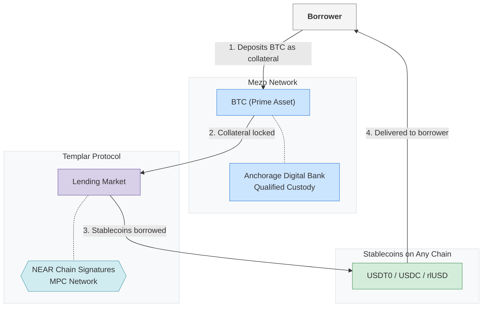
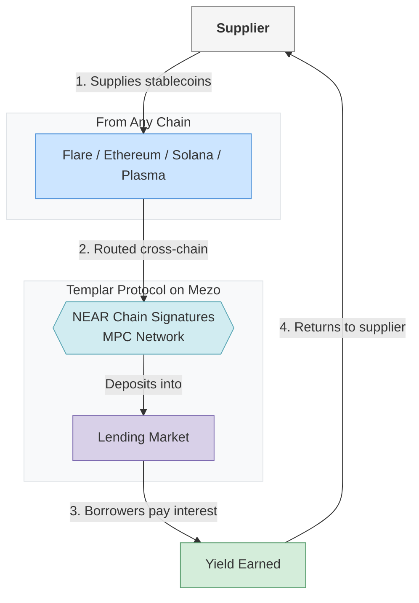
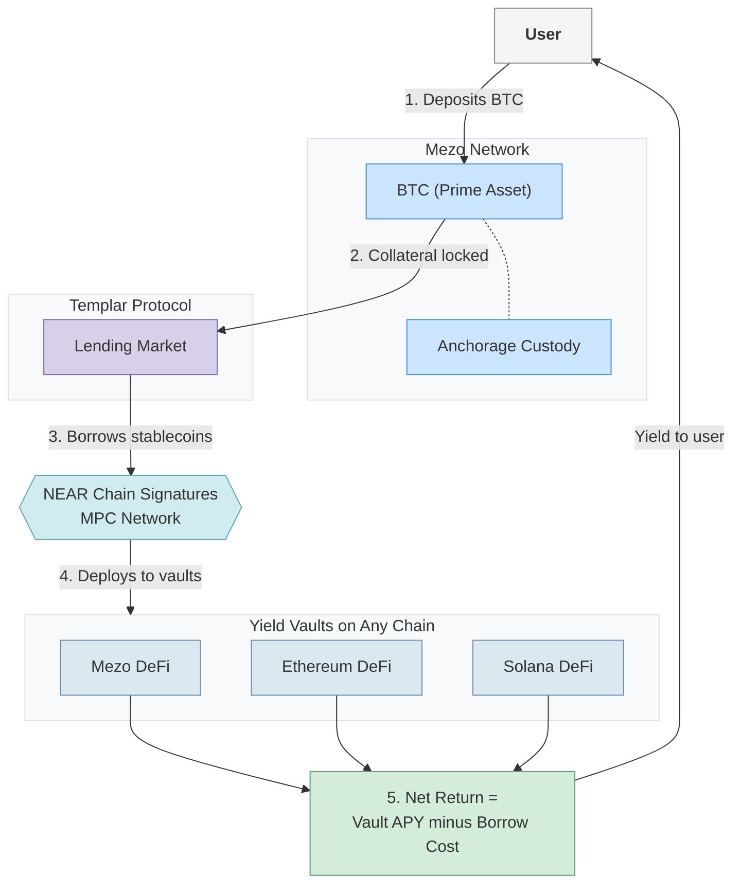
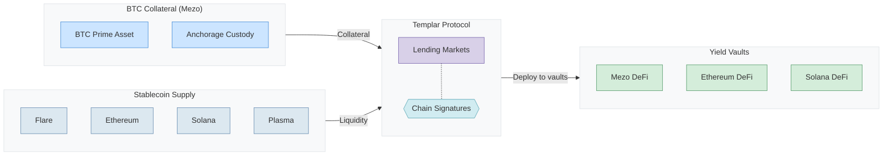

# Templar x Mezo: BTC Prime Asset Integration

## Overview

Templar lending markets can accept **BTC on Mezo** (Prime Asset) as collateral. BTC is minted on Mezo at the consensus level, backed by institutional-grade qualified custody at Anchorage Digital Bank. **NEAR Chain Signatures** enables Templar to sign cross-chain transactions — routing stablecoin liquidity from any chain and deploying borrowed assets into yield vaults.

---

## 1. Borrowing Flow

A borrower deposits BTC on Mezo as collateral into a Templar lending market. The BTC is backed by segregated, bankruptcy-remote custody at Anchorage Digital Bank. NEAR Chain Signatures enables cross-chain delivery of borrowed stablecoins to any chain the borrower chooses.

---

## 2. Supply Flow

A supplier deposits stablecoins from any supported chain into Templar lending markets. NEAR Chain Signatures routes the liquidity cross-chain into Templar on Mezo. Suppliers earn yield from borrower interest payments.

---

## 3. Yield Vault Deployment

A user deposits BTC on Mezo as collateral, borrows stablecoins, and deploys them into yield-generating vaults across multiple chains via NEAR Chain Signatures. If the vault yield exceeds the borrow cost, the user earns a net profit — making their BTC holdings productive.

---

## 4. Full Architecture Overview

The complete picture: BTC on Mezo (backed by Anchorage qualified custody) serves as collateral in Templar lending markets. Stablecoin liquidity flows in from suppliers on any chain. Borrowers can take stables directly or deploy them into yield vaults. NEAR Chain Signatures powers all cross-chain operations.

